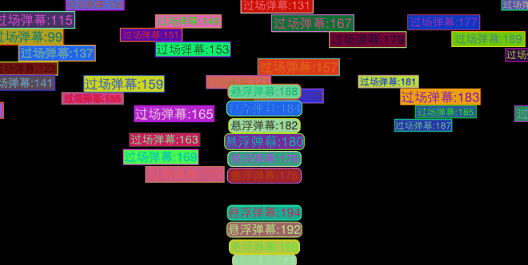
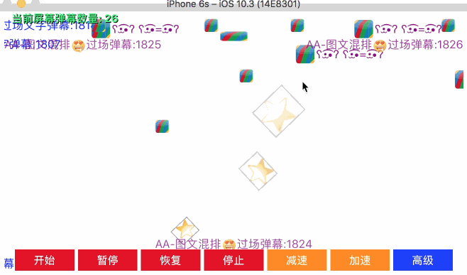

# BarrageRenderer


一个 iOS 上的开源弹幕渲染库.

## 发起原因

弹幕实质是多个精灵的时间上的渲染方式. PC/Web上已经有很成熟的解决方案了; Android上比较有名的是BiliBili开源的DanmakuFlameMaster, 但是开源社区尚没有比较好的iOS弹幕渲染器.觉得在二次元文化逐渐渗透的今天,视频弹幕已经是很重要的一种情绪表达方式了.没必要重复造轮子,所以我把自己写的一份弹幕渲染引擎开源了.还有一些需要后续完善的地方,但基本功能已经有了.祝大家玩得开心.

## Features

* 提供过场弹幕(4种方向)与悬浮弹幕(2种方向)支持; 支持图片弹幕与文字弹幕.
* 提供图文弹幕接口attributedText, 可按照demo中的指示生成图文混排弹幕.
* 弹幕字体可定义: 颜色,边框,圆角,背景,字体等皆可定制.
* 自动轨道搜寻算法,新发弹幕会根据相同方向的同种弹幕获取最佳运动轨道.
* 支持延时弹幕,为反复播放弹幕提供可能；支持与外界的时间同步.
* 独立的动画时间系统, 可以统一调整动画速度.
* 特制的动画引擎,播放弹幕更流畅,可承接持续的10条/s的弹幕流速.
* 丰富的扩展接口, 实现了父类的接口就可以自定义弹幕动画.
* 概念较清晰,可以为任意UIView绑定弹幕,当然弹幕内容需要创建控件输入.
* 因为作者记性比较差,所以在很多紧要处添加了注释,理解代码更容易.
* 效果动画如下图所示:





视频演示地址: [http://v.youku.com/v_show/id_XMTI5NDM4ODk3Ng==.html](http://v.youku.com/v_show/id_XMTI5NDM4ODk3Ng==.html)

## 使用方式

1. 下载版本库,进入BarrageRendererDemo目录. 运行pod update拉取相关库, 即可以运行BarrageRendererDemo.xcworkspace
1. 也可以在您工程的podfile中添加一条引用: *pod 'BarrageRenderer', '1.9.1'*  并在工程目录下的命令行中运行 pod update, (CocoaPods 版本 0.39)
1. 或者尝试使用 2.1.0 版本，此版本使用更方便，在部分特殊情况下的性能也有所提升.
1. 或者将代码下载下来, 将BarrageRenderer/目录添加到您的工程当中
1. 在需要使用弹幕渲染功能的地方 ```#import<BarrageRenderer/BarrageRenderer.h>```
1. 创建BarrageRenderer,添加BarrageRenderer.view, 执行start方法, 通过receive方法输入弹幕描述符descriptor, 即可以显示弹幕. 详见demo.
1. demo的基本功能演示了: 如何在view上增加一条弹幕, 如何启动、停止、暂停、恢复弹幕播放, 如何减速弹幕的运动速度.
1. demo的高级功能演示了: 如何使用自定义方式添加图文混排弹幕,如何支持录播中在固定时间点显示固定弹幕的逻辑.
1. 相关的[一篇博文](http://blog.exbye.com/2015/07/an-open-source-ios-barrage-renderer/)

## 使用细节

### 基本使用

一般的，你只需要在 ```- (void)viewDidLoad``` 里创建一个 BarrageRenderer 对象，并将其 view add 到你想要添加弹幕动画的 view 上，配置就结束了。

当你想要添加一条弹幕到屏幕上的时候，你只需要创建一个弹幕描述符 BarrageDescriptor, 为其指定弹幕 Sprite 的类名，然后通过 params 设置一些属性, 调用 BarrageRenderer 的 receive 方法即可成功将弹幕显示在屏幕上.

弹幕支持的属性可参照 ```BarrageSpriteProtocol.h``` 文件. 以及在 BarrageSprite 族的属性

### 动态移除弹幕

2.1.0 新增特性。

在某些情况下，你可能需要从屏幕中动态地移除弹幕。2.1.0版本为此提供了一个默认的弹幕标识符 ```params[@"identifier"]``` 以及 一个移除弹幕的方法 ```- (void)removeSpriteWithIdentifier:(NSString *)identifier;```。 举例而言，你可以在用户点击弹幕的时候，移除弹幕，代码如下：

``` objective-c
    __weak BarrageRenderer *render = _renderer;
    descriptor.params[@"clickAction"] = ^(NSDictionary *params){
        [render removeSpriteWithIdentifier:params[@"identifier"]];
    };
```

### 更新弹幕视图

2.1.0 新增特性。

有时候，你想要为你的弹幕精灵 view 添加动画。当然，你可以使用 animation 或者 NSTimer. 由于 BarrageRenderer 整体由 CADisplayLink 驱动，你可以借用 BarrageRenderer 的时钟，来更新你的精灵 view 。这样做的好处在于，当你通过 BarrageRenderer 暂停弹幕时，你的 弹幕精灵 view 也将暂停。为此，你可以在自定义弹幕精灵 view 的时候，实现协议方法 ```- (void)updateWithTime:(NSTimeInterval)time```来依据时间更新你的 view 。连贯起来就成了动画。你可以参考 demo 中 AvatarBarrageView 类的实现。

需要注意的是，```- (void)updateWithTime:(NSTimeInterval)time``` 中不要放置过多的计算逻辑。在大量弹幕下，这样有可能造成动画的卡顿。

### 设置靠边位置

1.9.0 版本支持为过场弹幕与悬浮弹幕设置"靠边"属性。对于过场弹幕，可设置side(BarrageWalkSide)属性；对于悬浮弹幕，可设置side(BarrageFloatSide)属性。代码表现为：

``` objective-c
descriptor.params[@"side"] = @(BarrageWalkSideRight); // 过场弹幕中，靠右侧行驶
```

``` objective-c
descriptor.params[@"side"] = @(BarrageFloatSideLeft); // 悬浮弹幕中，靠屏幕左侧堆叠
```

具体，可参考代码注释，以及demo中的使用范例。

### 设置隐入隐出

1.8.0 版本新增属性，仅对悬浮弹幕有效，设置如下：

``` objective-c
descriptor.params[@"fadeInTime"] = @(1);  // 隐入时间
descriptor.params[@"fadeOutTime"] = @(1); // 隐出时间
```

### 图文混排弹幕

最简单的弹幕只是文本, 但有时候你可能需要添加emoji表情或者图片上去。emoji表情是UTF字符集原生支持的，对待他和其他的文本字符没有区别；对于图片，你有两种方式可以添加图片弹幕, 一种是使用 attributedText 设置属性文本，一种是自定义 view. 自定义 view 可以参考 BarrageWalkImageTextSprite。 需要注意的是，如果 ```- (UIView *)bindingView``` 方法返回的是你自定义的 view，你需要覆盖你自定义 view 的 ```- (CGSize)sizeThatFits``` 方法，返回正确的 view 大小。

在 V2 版本中，bindingView 方法被废除，你需要通过 descriptor.params[@"viewClassName"] 指明 sprite 所要关联的 view 类。

### 直接在 Sprite 子类中布局元素

你可能在方法 ```- (UIView *)bindingView``` 中创建了许多视图元素，而并非返回一个自定义 view，因此，这时候你并不方便自定义 view 的 ```- (CGSize)sizeThatFits``` 方法，为此你可以选择覆盖 BarrageSprite 的 size 属性的 ```- (CGSize)size``` 方法，在此方法中返回你的弹幕 view 的大小。当然，在 ```- (UIView *)bindingView``` 里你要设置各个子 view 的位置，以及处理一些可变大小元素比如 UILabel 的布局问题。

在 V2 版本中，bindingView 方法被废除，相关的子 view 布局则写在 sprite 关联的 view 类中。

### 外部设置弹幕元素的大小

你也可以在创建弹幕描述符的时候强制指定弹幕元素的大小。通过设置：

```BarrageDescriptor.params[@"mandatorySize"]```

设置此属性之后，你自定义的弹幕 view 的 ```- (CGSize)sizeThatFits``` 将不再起作用，但是覆盖的 ```- (CGSize)size``` 方法仍然是有效的，因为它的优先级比较高。

### 如何调节轨道数量

继承自 BarrageFloatSprite 与 BarrageWalkSprite 的弹幕都有 trackNumber 属性，你可以用它来设置弹幕轨道数量。在宏 STRIP_NUM 中规定了最大的轨道数量。需要注意的是，BarrageRenderer 中的轨道概念比其他一些弹幕库的轨道概念更复杂，用它可以比较精确地进行冲突检测。当你的弹幕 view 拥有不同大小的时候，你会意识到他的威力。

如果你只是希望简单地调节一下轨道数量，你只需为 trackNumber 属性设置一个值即可。比如10，20... 并注意不要超过 STRIP_NUM 的值。

### 如何绑定视频播放时间，即支持快进快退

这其实是非直播类视频弹幕的刚需。由于涉及到弹幕存储，所以有些内容并不是单独 BarrageRenderer 可以解决的。BarrageRenderer 支持将弹幕绑定到视频的时间点上。实现策略一般有如下几步: 

1. 在视频初始化的时候，批量添加弹幕
1. 设置 BarrageRenderer 的 redisplay 属性为 YES, 指定其 delegate.
1. 对于1条被添加的 BarrageDescriptor, 为其指定 delay，delay 是此条弹幕对应的视频时间点(一般从服务器端获得)；在 2.1.0 版本之后，请尽量调用load方法。如果此条被添加的弹幕 BarrageDescriptor 来自某方实时发送的(因而服务端接口并未给出对应视频时间点)，可调用 receive 方法。
1. 实现 BarrageRendererDelegate 协议方法, 在 ```- (NSTimeInterval)timeForBarrageRenderer:(BarrageRenderer *)renderer;``` 方法中返回当前的视频时间点. 当你的视频播放、快进或者快退时，这个时间也会有变。

在 Demo 的 AdvancedBarrageController 中演示了这一流程，可以参照。

### 如何控制弹幕显示的区域

新版已经支持配置弹幕的显示区域。当你把 BarrageRenderer.view 添加到你的业务 view 上之后，默认情况下，弹幕的 view 会适应你的业务 view，你可以通过 BarrageRenderer 的 canvasMargin 属性来设置弹幕显示区域相对于你业务 view 的大小。如：
```_renderer.canvasMargin = UIEdgeInsetsMake(10, 10, 10, 10);```

### 修改弹幕的初始位置

原生的 BarrageSprite 子类不支持自定义弹幕位置。如果需要，你需要自定义你自己的 BarrageSprite。你可以继承 BarrageWalkTextSprite ，然后覆盖 ```- (CGPoint)originInBounds:(CGRect)rect withSprites:(NSArray *)sprites```根据屏幕上已有的同类弹幕信息返回你的弹幕的初始位置。另外需要注意的是，如果你是继承的 BarrageWalkSprite ，你还需要在此方法中计算出终点位置 ```CGPoint _destination;```的值。

### 如何设置弹幕速率与文本长度正相关

一些弹幕组件的速度会与文本长度成正比，这在 BarrageRenderer 中实现起来也十分容易。在创建弹幕描述符 BarrageDescriptor 的时候，根据文本长度设置 BarrageSprite 的速度值即可。

### 限制过场弹幕只显示屏幕上方5行

虽然 BarrageWalkSprite 弹幕设有 trackNumber 属性，但是 trackNumber 的本质，并不很适合某些业务下，固定屏幕弹幕行数的需求。若非要如此，比如需要限制过场弹幕只显示屏幕上方5行，可继承 BarrageWalkTextSprite ，重写```- (CGPoint)originInBounds:(CGRect)rect withSprites:(NSArray *)sprites```方法，如下：

```objective-c
- (CGPoint)originInBounds:(CGRect)rect withSprites:(NSArray *)sprites
{
    CGRect newRect = rect;
    newRect.size.height = 100; // 这里你根据你的文本大小，为固定的行数估出一个合适的高度来
    self.trackNumber = 5; // 这里是你需要限定的弹幕行数,这里设置之后，descriptor 的 trackNumber 参数自然就失效了
    return [super originInBounds:newRect withSprites:sprites];
}
```

如此，就生成了满足上述需求的弹幕形式。

### 为弹幕添加点击操作

BarrageRenderer 默认关闭了交互行为的，但如果需要，你可以启用，只需两步：

1. BarrageRenderer.view.userInteractionEnabled = YES;
1. 为 descriptor.params[@"clickAction"] 添加参数

在 2.0.1 版本，clickAction 指定的 block 增加了参数，以支持在点击阶段拿到弹幕的相关信息，比如弹幕消息的 id 。

### 如何使事件透传到底层(业务)view

开启 BarrageRenderer.view.userInteractionEnabled 之后，所有的事件都会被 BarrageRenderer 拦截掉而到不了你的业务 view，这时候你如果在你的业务 View 上添加一个 Button，而 BarrageRenerer.view 又在 Button 之上的话，那么点击这个 Button 是无效的。你可以设置只拦截弹幕上的事件，而将 BarrageRenderer.view 上的事件透传。通过设置属性：

* BarrageRenderer.masked = NO; // 默认为YES

### 如何对弹幕进行限流

通过 ```- (NSInteger)spritesNumberWithName:(NSString *)spriteName;``` 方法可以获取屏幕上当前的弹幕数量，你可以在调用 BarrageRenderer 的 receive 方法之前，获取屏幕上的弹幕数量，然后根据一定的规则决定要不要添加这条弹幕。缩小过场弹幕的速度幅度，也有助于降低弹幕的重叠几率。当然，最合理的方式，还是服务端将大量的弹幕过滤到一个合适的范围之中。

### 为弹幕添加背景图片

框架原生的 BarrageSprite 族并不支持添加背景图片。如果业务需要，可以通过继承 BarrageSprite 的方式添加。

### 提升动画性能

弹幕一般呈现在视频之上，而视频解码会消耗大量的 CPU，当可用 CPU 不足时，弹幕动画会出现卡顿。为使弹幕流畅，你可以将 trackNumber 调低一些。另外可以对屏幕上的弹幕数量进行限流。

实测中，如果多个弹幕的delay时间相同(或相距在1/60s之内)，可能使这些弹幕同时进入屏幕，进而导致瞬间卡顿。真实直播弹幕环境下，这种情况出现的比较少。针对性能较好的iPhone，可以设置 BarrageRenderer 的平滑系数 smoothness ，以优化此问题。此参数从 V2 开始支持。

## V2 重构

自 2.0 版本起, 对 sprite 及 dispatcher 进行了较大幅度的调整。主要有如下几点：

1. 分离 sprite 更新逻辑与弹幕视图，方便两者组合复用
1. 针对前版本 layout 不方便使用的问题做了优化
1. 为视图添加复用机制(不过实测中并没有太大性能提升)
1. 增加平滑度参数，优化一些特殊情况下的性能。

如果你在使用 V1 系列时，没有创建自己的 sprite 子类，那么你可以在不改动业务代码的时候，升级到 V2 版本; 否则，你需要改动你的 sprite 子类，当然，改动不会太大。

**虽然我对V2版本做了测试，但是无法涵盖所有情况。** 如果你的应用难以承担较高风险，那么你也可以保持使用 V1 系列，等到 V2 版本相对稳定时再行迁移, V1 不会再添加新的 feature, 但对于显著的 bug 我还是会提供修复; 如果你刚刚接入 V2, 那么建议你尝试使用 V2。

V2 在创建自定义弹幕的时候，涉及到两部分：

1.继承对应的 BarrageRenderer 子类，你也可以直接使用默认的 BarrageWalkSprite 或 BarrageFloatSprite，涉及到修改对应的 view 时，在创建 descriptor 的时候增加一条如下的代码：

``` objective-c
descriptor.params[@"viewClassName"] = @"UILabel";
```

2.将原来写在 sprite 子类 bindingView 中的布局代码迁出到独立的view中，为此类实现 BarrageViewProtocol 协议中的方法；一般可以为 view 类添加相应的扩展。比如 UILabel+BarrageView.h。如此，你的 sprite 不必再关心布局的细节，只需要处理好时间逻辑。

更详细的使用，你可以参考 BarrageRenderer 中提供的 sprite 默认实现或者 demo。

### load 方法的语义变化

在 v2.1.0 及之后的版本, load 语义有所调整。之前，load 方法所触发的 receive 调用, 会调整 descriptor 的 delay 参数; 而之后的版本，不再整 descriptor 的 delay 参数。所以对于播放弹幕 前/过程中 从网络加载的批量弹幕(delay属性是具体不变的)，推荐使用 load 方法。

## 支持与联系

* 欢迎在GitHub上提出相关的issue;
* 欢迎加入qq群讨论:325298378(回复不一定及时).
